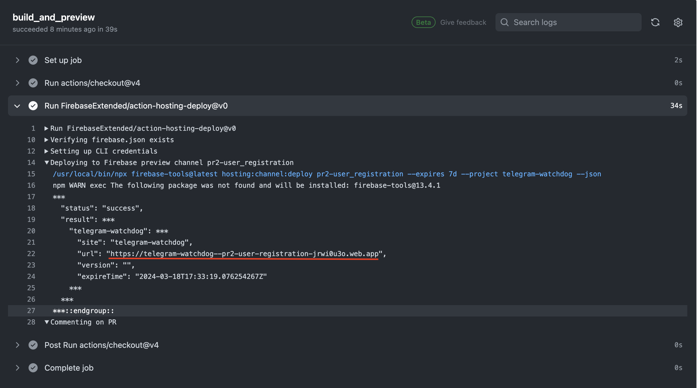

# Hosting watchdogs bot SPA on firebase
- Make changes locally and run the below command to run the server locally:
  `firebase emulators:start`
- Commit your changes and create a pull request. A temporary url will be generated on completion of triggered job on creating a pull request.
  
- Merge your changes to main branch to deploy changes to [production environment](https://telegram-watchdog.web.app).
  
